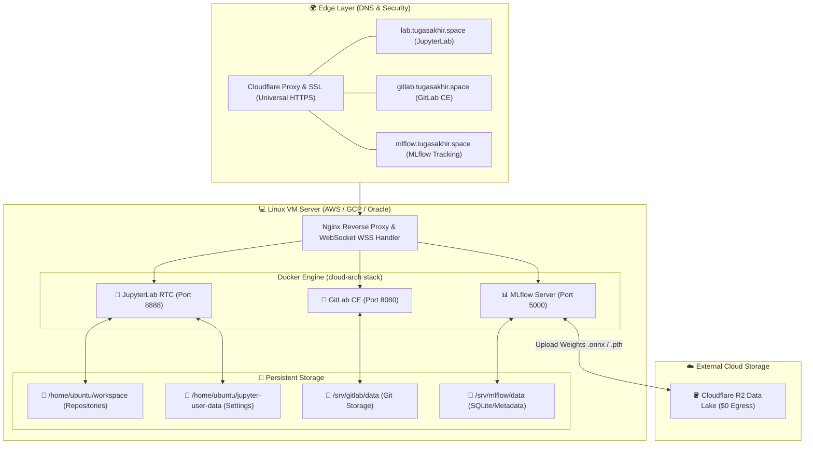

# 🏛️ CLOUD-ARCH TECHNICAL ARCHITECTURE BLUEPRINT

---

## 🛡️ Disaster Recovery Runbook (Pindah Server dalam 5 Menit):

1. Sewa VM baru di cloud mana pun (AWS / GCP / Oracle).
2. Arahkan IP publik baru ke Cloudflare DNS `tugasakhir.space`.
3. Jalankan `git clone ... && sudo ./deploy.sh`.
4. Seluruh layanan langsung online kembali dengan data yang aman di Cloudflare R2!
