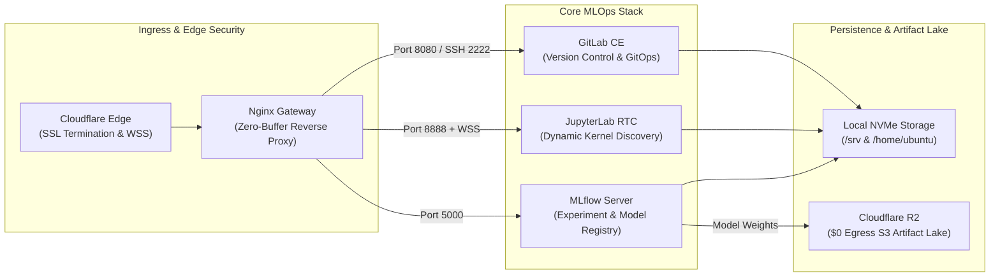

# Cloud-Arch Infrastructure

[](https://www.docker.com/)
[](https://jupyter.org/)
[](https://mlflow.org/)
[](https://about.gitlab.com/)
[](https://www.cloudflare.com/products/r2/)
[](https://ubuntu.com/)

This repository is the **Infrastructure as Code (IaC)** and automated orchestration blueprint for the **Cloud-Arch** AI/ML platform. It provisions and manages an integrated, resource-optimized MLOps ecosystem consisting of **GitLab CE**, **JupyterLab RTC**, and **MLflow Tracking Server** backed by **Cloudflare R2** and **Nginx**.

---

## 🏗️ Architecture & Service Topology



| Service | Subdomain | Host Port | Description |
| :--- | :--- | :--- | :--- |
| **GitLab CE** | `gitlab.<domain>` | `8080` (HTTP) / `2222` (SSH) | GitOps repository, CI/CD engine, code versioning |
| **JupyterLab RTC** | `lab.<domain>` | `8888` (HTTP/WSS) | Collaborative notebooks with dynamic `uv` kernel auto-discovery |
| **MLflow Server** | `mlflow.<domain>` | `5000` (HTTP) | Experiment tracking & model registry backed by Cloudflare R2 |
| **Nginx Proxy** | `*.<domain>` | `80` / `443` | Reverse proxy, WSS streaming router, and SSL gateway |

---

## 📋 Prerequisites

### 1. System Requirements & Tools
- **Operating System:** Ubuntu 22.04 LTS or Ubuntu 24.04 LTS (x86_64 / ARM64)
- **Compute & RAM:** Minimum 2 vCPU, 2.0 GB RAM
- **Storage:** 35+ GB NVMe SSD
- **Docker Engine:** v24.0+ & **Docker Compose:** v2.20+ *(auto-installed by `deploy.sh` if missing)*
- **Nginx:** Web server & reverse proxy

### 2. Access Credentials & External Services
Before provisioning, prepare the required credentials:
- **Cloudflare DNS:** Managed DNS zone for your target domain
- **Cloudflare R2:** S3 API credentials (`AWS_ACCESS_KEY_ID`, `AWS_SECRET_ACCESS_KEY`, and bucket name)
- **Resend SMTP:** API key for transactional email notifications
- *(Optional)* **Telegram Bot:** Bot Token & Admin Chat ID for remote telemetry notifications

---

## 🚀 Deployment & Provisioning

### 1. Clone the Repository
```bash
git clone https://github.com/rizkyyanuark/cloud-arch.git
cd cloud-arch
```

### 2. Environment Configuration
Copy the configuration template and set your environment variables:
```bash
cp .env.example .env
nano .env
```

Key environment parameters:
| Variable | Description | Example / Default |
| :--- | :--- | :--- |
| `BASE_DOMAIN` | Target root domain | `example.com` |
| `GITLAB_ROOT_PASSWORD` | Initial GitLab administrator password | `SecurePassword123!` |
| `AWS_ACCESS_KEY_ID` | Cloudflare R2 access key ID | `your_r2_access_key` |
| `AWS_SECRET_ACCESS_KEY` | Cloudflare R2 secret access key | `your_r2_secret_key` |
| `R2_BUCKET_NAME` | Cloudflare R2 bucket name | `mini-project-lake` |
| `SMTP_PASSWORD` | Resend API key for outbound emails | `re_123456789` |

### 3. Run Automated Provisioning
Execute the master deployment script with superuser privileges:
```bash
chmod +x deploy.sh
sudo ./deploy.sh
```

The script automatically executes:
- Kernel memory tuning and swap space initialization for workload stability.
- Docker Engine and Compose plugin dependency checks and installation.
- Persistent volume directories and permission mapping (`/srv/gitlab`, `/srv/mlflow`, `/home/ubuntu/workspace`).
- Nginx reverse proxy configuration generation and reload.
- Docker container builds and multi-service stack orchestration.

---

## 🌐 DNS & Edge Routing

Create `A` records in your Cloudflare DNS dashboard pointing to your server's public IP:

| Type | Name | Target | Proxy Status |
| :--- | :--- | :--- | :--- |
| `A` | `gitlab` | `<SERVER_PUBLIC_IP>` | Proxied (Orange Cloud) |
| `A` | `lab` | `<SERVER_PUBLIC_IP>` | Proxied (Orange Cloud) |
| `A` | `mlflow` | `<SERVER_PUBLIC_IP>` | Proxied (Orange Cloud) |

> **Note:** Ensure Cloudflare SSL/TLS encryption mode is set to **Full** (or **Strict**) and **WebSockets** are enabled under the *Network* tab.

---

## 🛠️ Operations & Maintenance (Day-2 Ops)

### Health Check Probe
Verify service availability across all subdomains:
```bash
./scripts/check_health.sh
```

### Service Stack Lifecycle
```bash
# Check container status
docker compose ps

# Inspect real-time service logs
docker compose logs -f jupyter
docker compose logs -f mlflow
docker compose logs -f gitlab

# Restart entire stack
docker compose restart
```

---

## 📁 Repository Structure

```text
cloud-arch/
├── .env.example             # Environment configuration template
├── docker-compose.yml       # Multi-container service definitions
├── deploy.sh                # Master automated provisioning script
├── ARCHITECTURE.md          # In-depth architectural design & technical rationales
├── README.md                # Infrastructure blueprint guide
├── jupyter/                 # JupyterLab RTC Dockerfile & dynamic kernel discovery
├── mlflow/                  # MLflow Tracking Dockerfile & R2 entrypoint
├── nginx/                   # Nginx reverse proxy configurations
├── telegram/                # Telemetry bridge daemon & systemd unit
└── scripts/                 # Health check probes & repository seeders
```

---

For detailed technical benchmarks, memory optimization parameters, and disaster recovery procedures, refer to [ARCHITECTURE.md](ARCHITECTURE.md).
