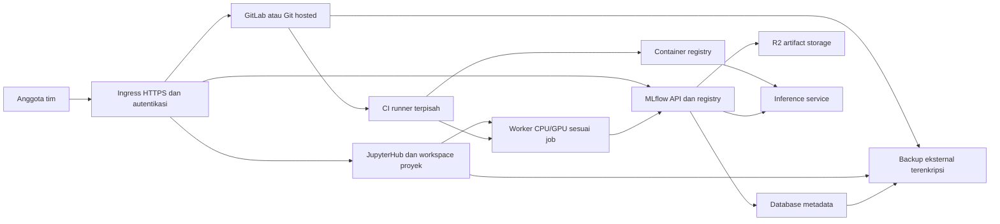

# Review Cloud-Arch untuk blueprint DevOps dan MLOps

Tanggal: 8 September 2026. Pemeriksaan server sekitar 03:59–04:04 UTC / 10:59–11:04 WIB.

Tujuan: menjadikan infrastruktur ini blueprint yang cepat dipasang, dapat direproduksi, dan mendukung pekerjaan AI/ML bersama anggota tim. Review mencakup seluruh berkas sumber repo, referensi Tutortoise, pemeriksaan read-only melalui `ssh ec2`, metadata EC2 melalui AWS CLI, serta beberapa GET HTTP tanpa kredensial. Tidak dilakukan deploy, restart, perubahan cloud, migrasi data, atau penulisan eksperimen.

**Penilaian utama**

Cloud-Arch sudah memiliki fondasi workspace riset: GitLab, JupyterLab RTC, kernel lingkungan proyek, MLflow, dan artifact storage R2. Kesenjangan terbesar adalah antara konfigurasi server yang telah berkembang dan konfigurasi yang dapat dipasang ulang dari repo. Keberadaan container yang berjalan belum membuktikan provisioning, kolaborasi, recovery, maupun siklus model sudah dapat direproduksi.

Prioritas yang disarankan: tutup akses origin MLflow yang melewati autentikasi domain; pulihkan backup; pisahkan identitas dan kredensial kolaborator; rekonsiliasi server dengan repo; kemudian bangun provisioning dan satu alur ML lengkap yang teruji. Compose masih sesuai sebagai dasar tahap ini. Penambahan Kubernetes, feature store, atau orkestrator besar belum menjadi kebutuhan yang dibuktikan oleh audit.

**1. Kondisi server yang terverifikasi**

| Komponen | Hasil pemeriksaan | Implikasi |
|---|---|---|
| Compute | EC2 `t4g.small`, ARM64, Ubuntu 24.04.4, `us-east-1a` | Pisahkan training berat dan build image dari host layanan. |
| Memori | RAM usable 1.835 MiB; available sekitar 193 MiB pada snapshot awal; swap 4.294 dari 6.143 MiB terpakai | Sangat sedikit ruang untuk notebook aktif dan job tambahan. Nilai ini adalah snapshot, bukan benchmark kapasitas tim. |
| GitLab | 19.2.4, healthy; Docker `State.OOMKilled=true`; penggunaan sekitar 1,15 GiB pada snapshot | Flag OOM perlu ditindaklanjuti; audit tidak menentukan waktu kejadian. Status healthy saat ini tidak menghapus masalah kapasitas. |
| Jupyter | Healthy; proses `jupyter-lab` berjalan sebagai `jovyan` | Compose memulai container sebagai root, tetapi tidak tepat menyatakan proses notebook aktif berjalan sebagai root. |
| MLflow | 3.15.2, berjalan tanpa health status Docker | Tambahkan readiness dan pemeriksaan fungsi, termasuk artifact. |
| Disk | Root EBS gp3 60 GiB, 3.000 IOPS, 125 MiB/s, `Encrypted=false`, `DeleteOnTermination=true` | Dokumentasi repo menyebut 35 GB. Data layanan saat ini berada pada root volume; hilangnya instance dapat ikut menghapusnya. Perubahan ke volume terenkripsi memerlukan rencana migrasi, bukan toggle pada volume ini. |
| Snapshot volume | Tidak ditemukan snapshot milik akun untuk volume root yang diperiksa di region ini | Tidak membuktikan semua backup eksternal tidak ada; perlindungan snapshot volume ini belum terlihat. |
| Backup cron | User cron menunjuk script harian `0 3 * * *` di `/home/ubuntu/mini-project-hub/scripts/gitlab_backup.sh`; script dan direktori lama tidak ada | Jadwal yang ditemukan tidak dapat menjalankan backup tersebut. Belum ada bukti restore berhasil. |
| Security group | Ingress 22, 80, 443, 2222, 8888 dari `0.0.0.0/0`; UFW inactive | HTTP origin dan SSH terbuka. Port 8888 masih bind ke loopback di Docker, sehingga rule SG tersebut tidak berarti Jupyter langsung terbuka saat ini, tetapi tetap tidak diperlukan. |
| Origin TLS | Nginx aktif hanya mendengarkan HTTP 80; tidak ada listener 443 pada host | README Full/Strict belum cocok dengan origin yang diperiksa. Mode Cloudflare aktual belum dibaca melalui API. |
| MLflow access | GET metadata experiment via origin publik, tanpa cookie/token: HTTP 200. GET yang sama via domain HTTPS: HTTP 302 | Origin dapat melewati penghalang pada domain. Bukti ini mengonfirmasi pembacaan metadata tanpa autentikasi; operasi tulis tidak diuji. |
| Jupyter access | GET `/api/contents` tanpa autentikasi melalui origin: HTTP 403 | Jangan menyamakan temuan MLflow dengan bypass Jupyter; pemeriksaan ini ditolak. |
| AWS identity | Profil CLI aktif terautentikasi sebagai account root; EC2 tidak memiliki instance profile; IMDSv2 diwajibkan | Gunakan identitas admin federasi/role untuk operasi harian dan instance role terbatas bila workload membutuhkan AWS API. IMDSv2 required adalah konfigurasi yang baik untuk dipertahankan. |
| CPU mode | T4g memakai `unlimited` | Pantau CPU credit dan biaya surplus jika beban berkelanjutan meningkat. |

Dokumentasi GitLab yang dibaca menyebut baseline single-node 16 GB dan profil constrained setidaknya 8 GB. Konfigurasi kecil dapat berjalan dengan kompromi, tetapi klaim repo bahwa swap mencegah OOM tidak merupakan jaminan. Ukuran profil tim harus ditentukan melalui pengujian jumlah pengguna, notebook, dan pekerjaan aktual. [GitLab requirements](https://docs.gitlab.com/install/requirements/), [constrained environments](https://docs.gitlab.com/omnibus/settings/memory_constrained_envs/).

**2. Drift antara repo dan server**

Server aktif menggunakan `/home/ubuntu/infra-hub`; beberapa komponen di sana berbeda dari repo ini. Hash isi yang dinormalisasi LF untuk Compose, Dockerfile MLflow, dan startup MLflow berbeda dari lokal.

| Area | Repo lokal | Server aktif |
|---|---|---|
| GitLab SSO Jupyter | `GitLabIdentityProvider` hanya membaca cookie; tidak dipasang pada konfigurasi server; shared token tetap disetel | Identity provider dipasang. Modul aktif memiliki handler login, callback, logout, pertukaran OAuth token, akses GitLab user API, dan penanganan `state`. Ini bukan audit menyeluruh keamanan implementasinya. |
| GPU | Bridge memanggil CLI `gpu`, tetapi implementasinya tidak dilacak | Kedua path helper GPU ditemukan. Keberadaan file belum membuktikan provisioning GPU berhasil. |
| Jupyter build | Direktori `jupyter/` | Server memiliki direktori `jupyter-custom/` dan image `infra-jupyter`. |
| Agent wrapper | Mount dari `/usr/local/bin/agy` | Mount aktif berasal dari `/home/ubuntu/.local/bin/agy`. |
| Backup | Tidak ada script/jadwal backup dalam repo | Ada cron lama dengan target yang hilang. |

Langkah pertama menjadikan repo sebagai sumber konfigurasi utama adalah inventarisasi dan porting komponen aktif yang memang dibutuhkan: OAuth, helper GPU, konfigurasi service, dan prosedur operasi. Secret harus tetap dipisahkan. Jangan langsung menjalankan `deploy.sh` lokal ke server aktif: konfigurasi lokal berpotensi mengganti perilaku yang sudah bekerja.

**3. Pembelajaran dari repo Tutortoise**

Referensi diperiksa pada commit `b554a437923efecd432ce69700efb08ac8003d37`. Repo tersebut memprovision aplikasi GCP dengan Terraform: modul network, instance, service account, storage, registry, Cloud Build, dan Cloud Run. Cloud Run menghubungkan backend dengan dua container inference; VM memasang PostgreSQL melalui startup script. Nilai yang dapat diambil adalah hubungan resource deklaratif, pemisahan modul, serta jalur source → build → registry → serving. [Komposisi Terraform](https://github.com/Tutortoise/infrastructure/blob/b554a437923efecd432ce69700efb08ac8003d37/main.tf), [Cloud Build](https://github.com/Tutortoise/infrastructure/blob/b554a437923efecd432ce69700efb08ac8003d37/modules/cloud_build/cloud_build.tf), [Cloud Run](https://github.com/Tutortoise/infrastructure/blob/b554a437923efecd432ce69700efb08ac8003d37/modules/cloud_run/cloud_run.tf).

| Dimensi | Cloud-Arch | Tutortoise | Arah pengembangan |
|---|---|---|---|
| Provisioning cloud | Belum ada kode EC2, SG, IAM, DNS | Terraform modular GCP | Tambahkan provisioning AWS dan Cloudflare, dengan mode host yang sudah ada. |
| Workspace riset | Jupyter RTC dan MLflow sudah menjadi inti | Tidak tersedia dalam repo infra referensi | Pertahankan fokus riset dan tambahkan identitas serta alur proyek. |
| Build dan serving | Belum ada runner/pipeline/endpoint model dalam blueprint | Build triggers, registry, Cloud Run inference | Bangun satu jalur rilis model lengkap. |
| Portabilitas | Domain, home directory, gateway, credential defaults masih spesifik pembuat | Nama bucket, repo, region, IP, dan file kredensial masih spesifik proyek | Gunakan konfigurasi tervalidasi dan default yang aman. |
| Recovery | Reinstall didokumentasikan; restore belum | Tidak ditemukan workflow backup/restore dalam tree | Jadikan restore test syarat rilis. |

Referensi bukan standar keamanan yang bisa disalin seluruhnya: firewall membuka SSH ke semua IP dan kedua bucket memberi akses baca objek kepada `allUsers`; image juga memakai `latest`. Tidak ditemukan training pipeline, experiment tracking, atau model promotion di repo infra itu, walaupun komponen tersebut mungkin berada di repo aplikasi lain. [Network](https://github.com/Tutortoise/infrastructure/blob/b554a437923efecd432ce69700efb08ac8003d37/modules/network/network.tf), [Storage](https://github.com/Tutortoise/infrastructure/blob/b554a437923efecd432ce69700efb08ac8003d37/modules/storage/storage.tf), [tree referensi](https://github.com/Tutortoise/infrastructure/tree/b554a437923efecd432ce69700efb08ac8003d37).

**4. Backlog DevOps berdasarkan prioritas**

P0 berarti temuan aktif yang perlu didahulukan; P1 berarti syarat utama blueprint tim; P2 berarti peningkatan keandalan berikutnya. Urutan ini bukan hasil penetration test lengkap.

| Prioritas | Pengembangan | Bukti dan kriteria selesai |
|---|---|---|
| P0 | Tutup bypass MLflow origin | GET metadata tanpa autentikasi ke origin publik saat ini 200. Pilih ingress privat melalui tunnel, atau origin HTTPS dengan pembatasan sumber dan verifikasi akses. Browser serta SDK/runner harus punya jalur autentikasi masing-masing. Uji ulang direct-origin dan akses sah. |
| P1 | Perbaiki backup dan lakukan restore drill | Target cron hilang; snapshot volume tidak ditemukan. Backup GitLab data, konfigurasi dan secrets, database MLflow konsisten, workspace, serta konfigurasi platform ke storage eksternal terenkripsi. Tetapkan retensi, alert kegagalan, dan buktikan pemulihan pada VM terpisah. |
| P1 | Pisahkan secret host dari notebook | Compose memasang `.ssh` read-only, `.gemini` read-write, dan credential store Git bersama. Mount dan keterbacaan direktori juga terlihat pada server; isi setiap credential tidak dibaca. Hapus mount secret pribadi dari workspace kolaboratif dan gunakan identitas per pengguna/proyek. |
| P1 | Ganti penggunaan AWS root untuk operasi rutin | STS mengidentifikasi account root. Siapkan Identity Center/federasi atau assume-role, lalu gunakan credential sementara. Jenis credential root dan MFA belum diaudit; jangan menonaktifkan akses sebelum jalur pengganti teruji. |
| P1 | Rekonsiliasi server dan repo | OAuth dan GPU helper aktif belum direproduksi oleh kode lokal. Inventarisasi versi dan konfigurasi tanpa menyalin secret, lalu deploy ke host uji. |
| P1 | Tambahkan resource budget | Container tidak memiliki limit; RAM sangat sempit. Pisahkan runner/build/training, tetapkan budget per notebook, pantau OOM, swap, disk, serta CPU credit. Jangan menambah semua service baru ke host 2 GB. |
| P1 | IaC untuk AWS dan Cloudflare | Sediakan network/SG, IAM, compute, encrypted data volume, DNS/Access, dan backup policy. Resource existing dapat di-import atau direferensikan sesuai kepemilikan; review plan harus tidak mengganti EC2/data tanpa rencana migrasi. |
| P1 | Provisioning idempotent dan preflight | Validasi konfigurasi sebelum mengubah host; hentikan pada placeholder credential. Hindari penyalinan `.env.example` lalu deploy otomatis dengan nilai bawaan. Uji instalasi bersih dan apply kedua. |
| P2 | Satu konfigurasi untuk domain, port, path | Compose mengizinkan perubahan port tetapi Nginx memaku 8080/8888/5000. Gateway `172.18.0.1` tidak dijamin oleh network definition. Parameterkan data root, UID/GID, hostname dan routing. |
| P2 | Pin dependency dan image | Hindari `latest`; buat lock dependency dan versi rilis platform. Pada Dockerfile MLflow, `>=` tidak dikutip sehingga `>` diproses sebagai redirection shell. Perbaiki quoting dan gunakan dependency yang terkunci. |
| P2 | Health dan observability | `check_health.sh` memaku domain dan tidak mengembalikan kegagalan sesuai hasil; deploy langsung menyatakan aktif sesudah `up -d`. Tambahkan readiness, timeout, exit status, pemeriksaan API dan artifact; alert eksternal untuk down/OOM/disk/backup. |
| P2 | Jadikan Telegram add-on opt-in | Installer selalu memasangnya; unit tidak memuat `.env`; admin ID contoh tidak dipakai oleh implementasi. Perbaiki konfigurasi, allowlist pada semua handler, OAuth state/session binding dan listener loopback. Isolasi agent dari akses administratif host. |
| P2 | Hilangkan patch auth GitLab dari jalur standar | SQL repo memberi password awal bersama dan auto-confirm email. Pemasangannya tidak ditemukan pada deploy; file Ruby override dengan nama yang diaudit tidak ada di container aktif. Gunakan invite/reset resmi atau SSO; status SQL trigger live belum diperiksa. |

Rujukan kode utama: [Compose](C:/Users/rizky/Documents/GitHub/cloud-arch/docker-compose.yml:59), [mount notebook](C:/Users/rizky/Documents/GitHub/cloud-arch/docker-compose.yml:93), [deploy](C:/Users/rizky/Documents/GitHub/cloud-arch/deploy.sh:35), [Nginx](C:/Users/rizky/Documents/GitHub/cloud-arch/nginx/conf.d/cloud-arch.conf:12), [health probe](C:/Users/rizky/Documents/GitHub/cloud-arch/scripts/check_health.sh:5), [Telegram OAuth](C:/Users/rizky/Documents/GitHub/cloud-arch/telegram/telegram_antigravity_bridge.py:201), [GitLab trigger](C:/Users/rizky/Documents/GitHub/cloud-arch/gitlab/init_db_trigger.sql:7).

Origin HTTPS diperlukan untuk Full/Strict; memasang Cloudflare saja belum mengamankan jalur langsung ke origin. Backup GitLab juga memerlukan konfigurasi/secrets terpisah dan restore dengan versi/type GitLab yang sesuai. [Cloudflare Full](https://developers.cloudflare.com/ssl/origin-configuration/ssl-modes/full/), [GitLab Docker backup](https://docs.gitlab.com/install/docker/backup/), [GitLab restore](https://docs.gitlab.com/administration/backup_restore/restore_gitlab/), [AWS root guidance](https://docs.aws.amazon.com/IAM/latest/UserGuide/root-user-best-practices.html), [Terraform import](https://developer.hashicorp.com/terraform/language/import).

**5. Backlog MLOps untuk pekerjaan kolaboratif**

1. **Identitas dan workspace.** Untuk profil tim, gunakan JupyterHub dengan GitLab OAuthenticator serta container/server per pengguna atau proyek. Workspace pribadi terpisah; RTC digunakan pada server proyek yang sengaja dibagikan. Tentukan siapa dapat membaca data, membuka terminal, mengubah environment dan mengundang anggota. Server RTC tetap berbagi kemampuan eksekusi dan secret proyek; SSO saja tidak membuat isolasi file. Implementasi OAuth live dapat menjadi masukan kebutuhan migrasi, bukan langsung diganti tanpa uji. [JupyterHub sharing](https://jupyterhub.readthedocs.io/en/latest/reference/sharing.html), [GitLab OAuthenticator](https://oauthenticator.readthedocs.io/en/latest/tutorials/provider-specific-setup/providers/gitlab.html).

2. **Onboarding artifact MLflow.** Konfigurasi `--default-artifact-root s3://...` membuat klien menggunakan storage langsung untuk experiment dengan lokasi itu. Untuk onboarding yang tidak membagikan master key R2, sediakan artifact proxy dengan `--artifacts-destination` dan autentikasi layanan. Experiment lama mempertahankan artifact location; perlu inventarisasi dan migrasi atau experiment baru. Uji ukuran model representatif terhadap batas Nginx dan edge. [Startup lokal](C:/Users/rizky/Documents/GitHub/cloud-arch/mlflow/run_mlflow.sh:4), [MLflow server](https://mlflow.org/docs/latest/self-hosting/architecture/tracking-server/).

3. **Template proyek ML.** Sertakan `pyproject.toml`, `uv.lock`, `ipykernel`, MLflow client, konfigurasi training, test, dataset manifest dan baseline kecil. Perintah onboarding harus berakhir pada train → log metric → upload artifact → download artifact. Catat commit SHA, dataset version/checksum, image/environment digest, seed, parameter, metric dan owner pada setiap run. Penemuan kernel saat ini hanya memeriksa executable Python, sehingga venv tanpa `ipykernel` tetap dapat muncul lalu gagal. Normalisasi nama folder juga dapat membuat collision. [Kernel discovery](C:/Users/rizky/Documents/GitHub/cloud-arch/jupyter/dynamic_kernels.py:20).

4. **CI/CD dan model promotion.** Blueprint membutuhkan runner terpisah, registry image yang dipilih secara eksplisit, lint/test, smoke training, evaluasi terhadap baseline, publikasi artifact/image immutable, dan promosi model melalui persetujuan atau aturan kualitas. Seeder sekarang hanya membuat dua grup; registry GitLab dimatikan dan pipeline tidak disediakan. [Seeder](C:/Users/rizky/Documents/GitHub/cloud-arch/scripts/seed_gitlab.py:25), [registry setting](C:/Users/rizky/Documents/GitHub/cloud-arch/docker-compose.yml:39).

5. **Worker CPU/GPU.** Bawa implementasi helper GPU yang ada pada server ke dependency atau modul terversi. Definisikan provisioning, image, arsitektur CPU/CUDA yang didukung, akses data, checkpoint, retry, penghentian saat idle, serta cleanup saat gagal. Host ARM64 layanan dan worker GPU x86_64 tidak otomatis memakai environment native yang sama. Runner dan training berat berjalan di worker terpisah; pilih satu backend worker dahulu.

6. **Metadata dan recovery.** SQLite tetap layak untuk profil kecil bila backup konsisten dan restore diuji. PostgreSQL menjadi pilihan profil tim saat logging serentak atau tuntutan availability membenarkannya. R2 artifact tidak menggantikan backup metadata eksperimen dan model registry. Migrasi database harus mempertahankan referensi artifact.

7. **Serving yang dapat diulang.** Tambahkan satu endpoint inference contoh, schema input/output, healthcheck, version/digest model, smoke test, latency/error metrics dan rollback. Setelah pola ini bekerja, tambahkan autoscaling atau orkestrator sesuai kebutuhan terukur.

8. **Tambahan GenAI bila digunakan.** Untuk RAG/LLM, versioning prompt, model/provider, embedding, konfigurasi chunking/retrieval, corpus snapshot, golden evaluation set, tracing dan pengukuran token/biaya melengkapi tracking model tradisional. Data trace harus mengikuti akses dan retensi proyek. Feature ini opsional, bergantung workload pengguna.

**6. Bentuk blueprint yang disarankan**

Pisahkan cara memperoleh host dari profil layanan. Mode `existing-host` mengonfigurasi server yang disediakan pengguna. Mode `aws-new` memprovision resource baru. Profil `minimal` dan `team` menentukan layanan serta batas kapasitas; worker GPU dan Telegram merupakan add-on.

```text
cloud-arch/
  infra/
    modules/            # AWS network, IAM, compute, data, edge, backup
    environments/       # Konfigurasi lingkungan dan contoh variabel
    bootstrap/          # Remote state, locking, dan akses awal
  provision/
    inventory/          # Termasuk mode existing-host
    roles/              # User, Docker, storage, ingress, backup
  platform/
    compose.yaml
    profiles/           # Minimal/team; GitLab dan add-on opsional
    jupyterhub/
    mlflow/
  workers/              # Satu backend CPU/GPU yang didukung dahulu
  templates/
    ml-project/         # Contoh alur ML yang dapat dijalankan ulang
  tests/
    smoke/
    restore/
  docs/
    quickstart.md
    onboarding.md
    backup-restore.md
    upgrade-rollback.md
```

Ini adalah rancangan struktur, belum implementasi. Pembagian tanggung jawab: Terraform/OpenTofu mengelola resource cloud; Ansible mengonfigurasi host; Compose menjalankan layanan; CI menguji dan merilis blueprint. Pilih satu tool IaC untuk implementasi awal. Bootstrap remote state dan secret references harus terdokumentasi agar instalasi tidak memiliki prasyarat tersembunyi. Pastikan siapa pemilik setiap resource jelas, terutama VPC/SG yang mungkin sudah digunakan resource lain.

Untuk pemasangan cepat, bangun image terversi di CI dan distribusikan digest-nya. Pengguna baru tidak perlu mengompilasi seluruh stack pada VM kecil. Sediakan satu konfigurasi tervalidasi, preflight, tahap plan/provision, configure, lalu verify. Hasil akhir installer memuat URL layanan, status kesiapan, dan langkah onboarding tanpa mencetak secret.

| Profil | Sasaran | Keputusan kapasitas |
|---|---|---|
| Minimal | Eksperimen pribadi atau kelompok kecil tepercaya; hosted Git bisa dipakai untuk mengurangi beban | Jangan menjanjikan 2 GB untuk GitLab + notebook aktif + training. Gunakan pengukuran; SQLite dan observability ringan cukup sebagai awal. |
| Team | Identitas individual, workspace proyek, CI, metadata dan recovery bersama | Alokasikan kapasitas layanan sesuai GitLab/Jupyter yang dipakai; tempatkan runner dan training di luar host layanan. PostgreSQL opsional berdasarkan kebutuhan. |
| GPU/serving add-on | Training berat dan rilis model | Provision sesuai job, simpan checkpoint/artifact di storage, batas runtime dan idle, verifikasi cleanup. |

Target arsitektur:



Panah menunjukkan alur logis; implementasi harus menetapkan identitas workload dan akses jaringan untuk setiap hubungan. Artifact proxy menyederhanakan distribusi credential, tetapi ukuran file dan pembatasan edge tetap perlu diuji.

**7. Urutan pelaksanaan dan bukti selesai**

| Tahap | Hasil yang dibangun | Bukti selesai |
|---|---|---|
| A — akses dan recovery | Perbaikan origin MLflow, credential isolation, backup yang benar, pengganti AWS root untuk operasi rutin | Akses tanpa izin ditolak; akses browser dan SDK sah berhasil; backup baru dapat dipulihkan. |
| B — rekonsiliasi | Konfigurasi live yang diperlukan masuk repo tanpa secret; versi dan dependency dikunci | Server uji menjalankan fitur OAuth/kernel/GPU hook yang sama; perubahan terdokumentasi. |
| C — blueprint v1 | Existing-host + AWS-new, provisioning idempotent, ingress dan konfigurasi tunggal | Fresh install berhasil; apply kedua tidak mengubah hal yang tidak perlu; domain/path alternatif bekerja. |
| D — kolaborasi ML | Dua identitas, template proyek, runner dan artifact workflow | Dua user bisa bekerja terpisah dan berbagi proyek RTC secara sengaja; log/download artifact tanpa master key storage di notebook. |
| E — lifecycle model | Worker job, evaluation gate, registry, inference dan rollback | Commit → train → evaluate → release → inference dapat diulang; kegagalan job membersihkan resource. |

Untuk EC2 yang sudah ada, mulai dari inventory dan backup. Adopsi IaC tidak memerlukan penghancuran atau pembuatan ulang instance. Import/referensikan resource secara bertahap, periksa plan terhadap replacement, lalu uji blueprint pada host terpisah sebelum cutover data. [Terraform import workflow](https://developer.hashicorp.com/terraform/language/import).

Release blueprint baru dianggap siap bila: instalasi dari konfigurasi bersih lulus; deploy ulang idempotent; dua identitas dan offboarding berfungsi; training contoh serta transfer artifact berhasil; recovery mengembalikan repository, notebook, run history dan registry; model dapat di-rollback; dan observability mendeteksi kegagalan layanan serta backup. Ukur durasi instalasi dan restore sebelum mencantumkan janji waktu pada README.

**Batas pemeriksaan**

Audit ini tidak memeriksa isi private key, token, dataset, notebook pengguna, atau object R2. Kebijakan Cloudflare Access, IAM organisasi, seluruh backup eksternal, validitas restore, SQL trigger GitLab live, dan eksekusi GPU end-to-end belum diverifikasi. Pemeriksaan HTTP hanya operasi baca dengan hasil status; kemampuan menulis/menghapus tanpa autentikasi tidak diuji. Rekomendasi kapasitas dan alur rilis adalah rancangan yang perlu diuji, bukan klaim implementasi sudah tersedia.
